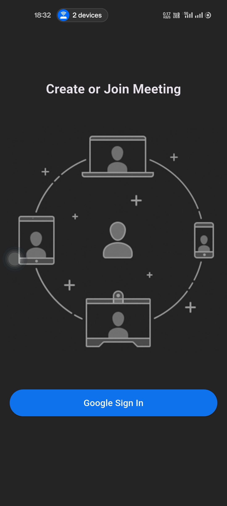
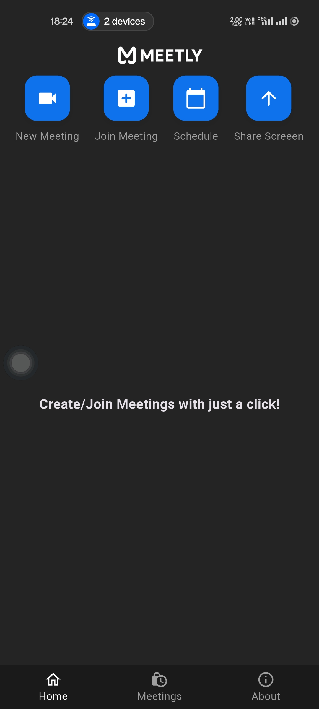
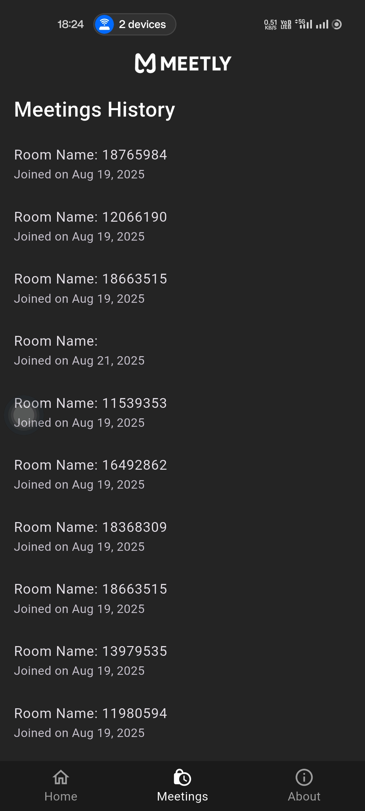
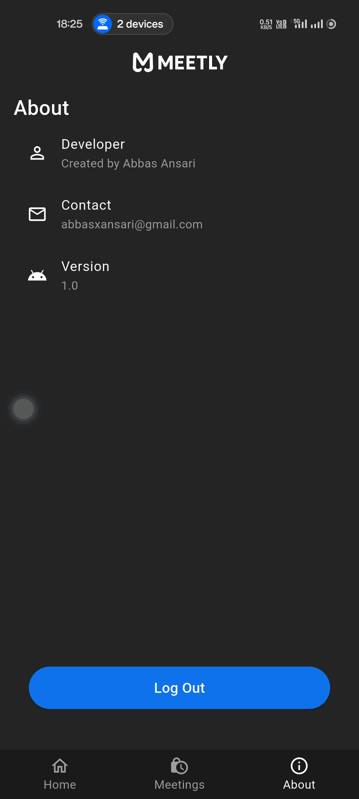
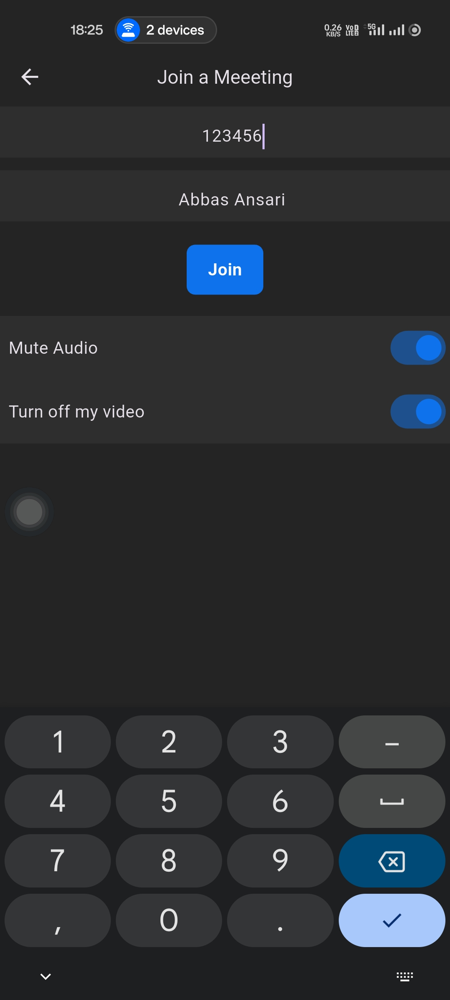
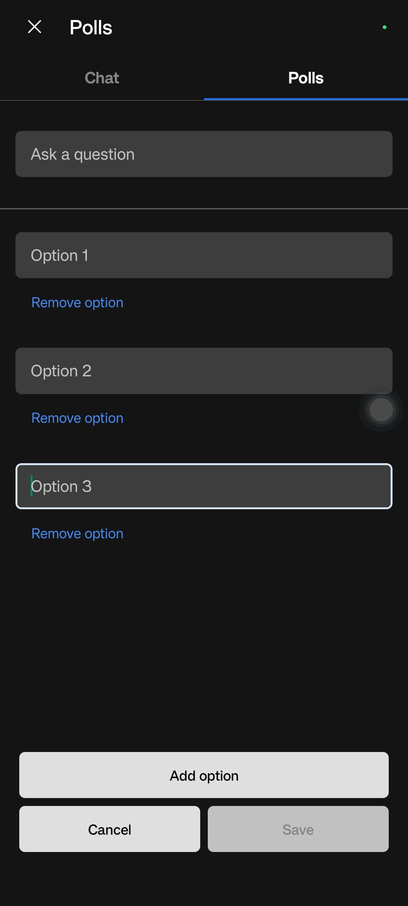
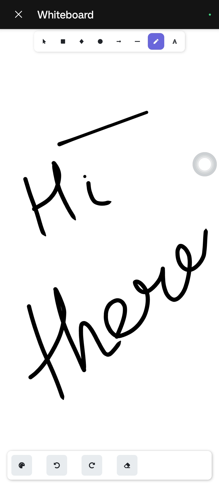
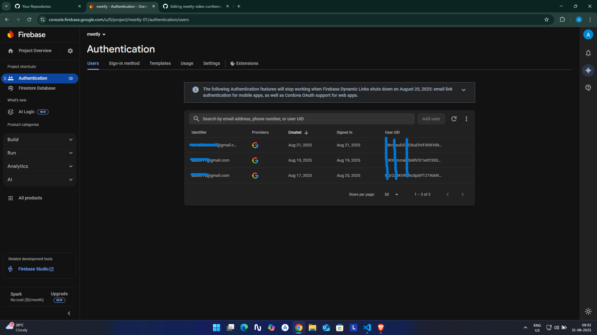
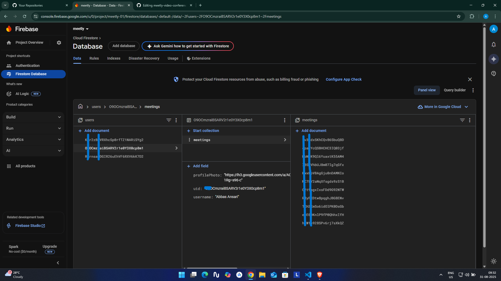

# 📹 Meetly – Video Conferencing App  

Meetly is a modern **video conferencing app** built with **Flutter**, supporting **Android & iOS**. 
It allows users to start or join meetings, chat, and collaborate in real time with a clean, minimal UI.  
 

---

## 📱 Screenshots

|  |  |  |  |  |
|:--:|:--:|:--:|:--:|:--:|
| **Login Screen** | **Home Screen** | **Meeting History** | **About Screen** | **Join Meeting** |

|  |  |  |  |  |
|:--:|:--:|:--:|:--:|:--:|
| **In-Meeting – Video Call** | **In-Meeting – Chat** | **In-Meeting – Polls** | **In-Meeting – Whiteboard** | **In-Meeting – Options** |

|  |  |
|:--:|:--:|
| **Firebase Authentication** | **Firestore Database** |


---

## ⚙️ Features  

- 🔐 Firebase Authentication (Google Sign-In)  
- 📂 **Firestore Integration** – used for meeting history sync
- 🎥 Start or Join a Meeting with a unique code  
- 🎤 Mute / Unmute microphone  
- 📸 Turn camera on / off  
- 👥 See all participants in the meeting  
- 💬 In-meeting chat  
- 🕒 View **meeting history with timestamps**   
- 📱 Works smoothly on **both Android and iOS (iOS support not tested yet).**  

---

## 🛠️ Tech Stack  

- **Flutter** – Cross-platform UI framework  
- **Firebase Authentication** – Google Sign-In for secure login  
- **Firebase Firestore** – Real-time database for storing meetings & chats  
- **jitsi_meet_flutter_sdk** – Real-time video & audio conferencing
  
---

## 🚀 Getting Started

### Prerequisites
- [Flutter SDK](https://docs.flutter.dev/get-started/install) installed  
- Firebase project setup ([Guide](https://firebase.google.com/docs/flutter/setup))   

---

### 🔧 Installation  

#### 1. Clone the repo  
```bash
git clone https://github.com/your-username/meetly.git
cd meetly
```

#### 2. Install dependencies  
```bash
flutter pub get
```

#### 3. Set up Firebase  

- Add your **`google-services.json`** (Android) inside:  `android/app/`

- Add your **`GoogleService-Info.plist`** (iOS) inside:  `ios/Runner/`

#### 4. Run the app  
```bash
flutter run
```

---

## ♻️ Contributing

Thanks for wanting to contribute! Please:

1. Fork the repo
2. Create a branch: `git checkout -b feature/short-description`
3. Commit: `git commit -m "Add: short description"`
4. Push: `git push origin feature/short-description`
5. Open a Pull Request describing the change

Please run tests and update docs as needed.

---

## 🙏 Acknowledgements  

- **Flutter** — for building beautiful, cross-platform mobile applications.  
- **Firebase** — for backend services like authentication, database, and cloud functions.  
- **Jitsi Meet Flutter SDK** — for enabling seamless video conferencing integration.  
- **Dart** — for the powerful and productive programming language behind Flutter.  
- **Android & iOS SDKs** — for platform-specific integration and native capabilities.  
- **Open Source Community** — for providing libraries, tools, and resources that made this project possible.  

---

## 👨‍💻 Author  

Developed by **Abbas Ansari** ✨  
- 💼 [LinkedIn](https://www.linkedin.com/in/abbas-ansari/)  
- 💻 [GitHub](https://github.com/abbasdx)  
- 📩 Email: abbasxansari@gmail.com  
